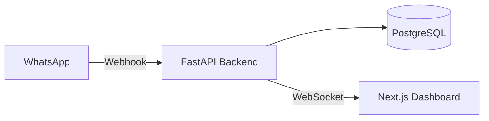

# LeaveFlow 🚀

LeaveFlow is a production-grade, event-driven Leave Automation System designed to bridge the gap between employees (via WhatsApp) and HR/Managers (via a Next.js Dashboard).

## ✨ Key Features
- **WhatsApp-Native Interaction:** Employees apply for leave simply by texting "leave tomorrow sick" to a WhatsApp bot.
- **Real-Time Manager Dashboard:** WebSockets push live updates to the React dashboard instantly.
- **Automated Validation:** Business logic prevents overdrafting leave balances and handles overlapping requests.
- **Async & Scalable:** Built on FastAPI and Asyncpg for high-concurrency webhook handling.

## 🏗️ Architecture



See [docs/ARCHITECTURE.md](./docs/ARCHITECTURE.md) for a deep dive into the architectural decisions and trade-offs.

## 🚀 Getting Started

### Prerequisites
- Docker & Docker Compose
- WhatsApp Business API Credentials

### Installation
1. Clone the repository
2. Rename `.env.example` to `.env` and fill in your credentials.
3. Run the complete stack:
   ```bash
   docker-compose up --build
   ```
4. Access the API at `http://localhost:8000` and the Dashboard at `http://localhost:3000`.

## 🧪 Testing
The backend features a comprehensive `pytest` suite utilizing `aiosqlite` for fast, zero-dependency in-memory testing.
```bash
cd backend
pip install -r requirements-dev.txt
pytest tests/
```

### Load Testing
We use [Locust](https://locust.io/) to benchmark API performance and scalability.
```bash
pip install locust
locust -f locustfile.py
```
Then navigate to `http://localhost:8089` to start the swarm and view real-time latency and throughput metrics.
