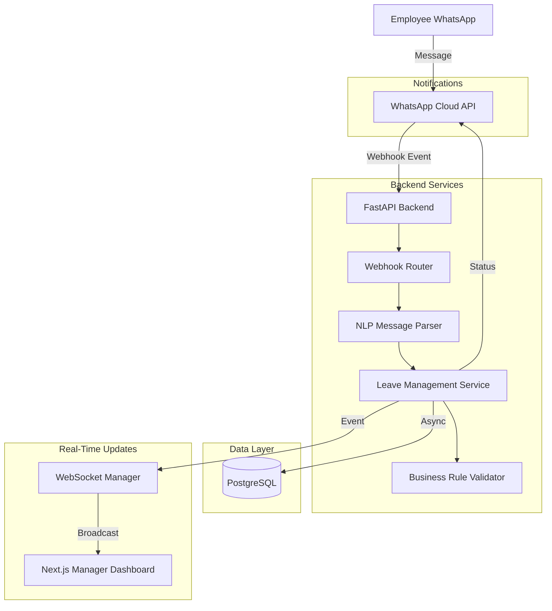

# LeaveFlow: System Design & Architecture

This document outlines the architectural decisions and system design principles behind LeaveFlow. It is structured to provide clear talking points for system design interviews.

## 1. High-Level Architecture

## 2. Core Architectural Choices & Trade-offs

### 2.1 Web Framework: FastAPI
**Why:**
- **Asynchronous by Default:** Native `async/await` support handles concurrent webhook events from WhatsApp efficiently without blocking threads.
- **Data Validation:** Pydantic models automatically validate incoming webhooks and API payloads, rejecting malformed data before it hits the business logic.
- **Performance:** Built on Starlette and Uvicorn, offering Node.js/Go-like performance for IO-bound webhook processing.

### 2.2 Database Layer: PostgreSQL + SQLAlchemy Asyncio
**Why:**
- **Relational Integrity:** Leave balances, requests, and user hierarchies are highly relational. ACID compliance is non-negotiable for HR data.
- **Async I/O:** Using `asyncpg` combined with SQLAlchemy 2.0 async sessions prevents database queries from blocking the event loop, maximizing throughput.
- **Trade-off:** Async SQLAlchemy is more complex to set up than synchronous ORMs, but the scalability benefits under load justify the complexity.

### 2.3 Real-Time Communication: WebSockets
**Why:**
- **Low Latency:** Managers need immediate notification when high-priority leaves (e.g., sick leaves) are requested.
- **Event-Driven UI:** Instead of the React frontend polling the database every 5 seconds (which wastes resources), the backend pushes JSON events (`NEW_REQUEST`, `STATUS_UPDATE`) only when state changes.

### 2.4 Extensibility: The NLP Parser
**Why:**
- The parser is decoupled from the WhatsApp router. It accepts raw text and returns a structured `Command` intent.
- This allows us to easily swap out regex parsing for an LLM (e.g., OpenAI/Gemini) in the future without touching the webhook logic or the database layer.
