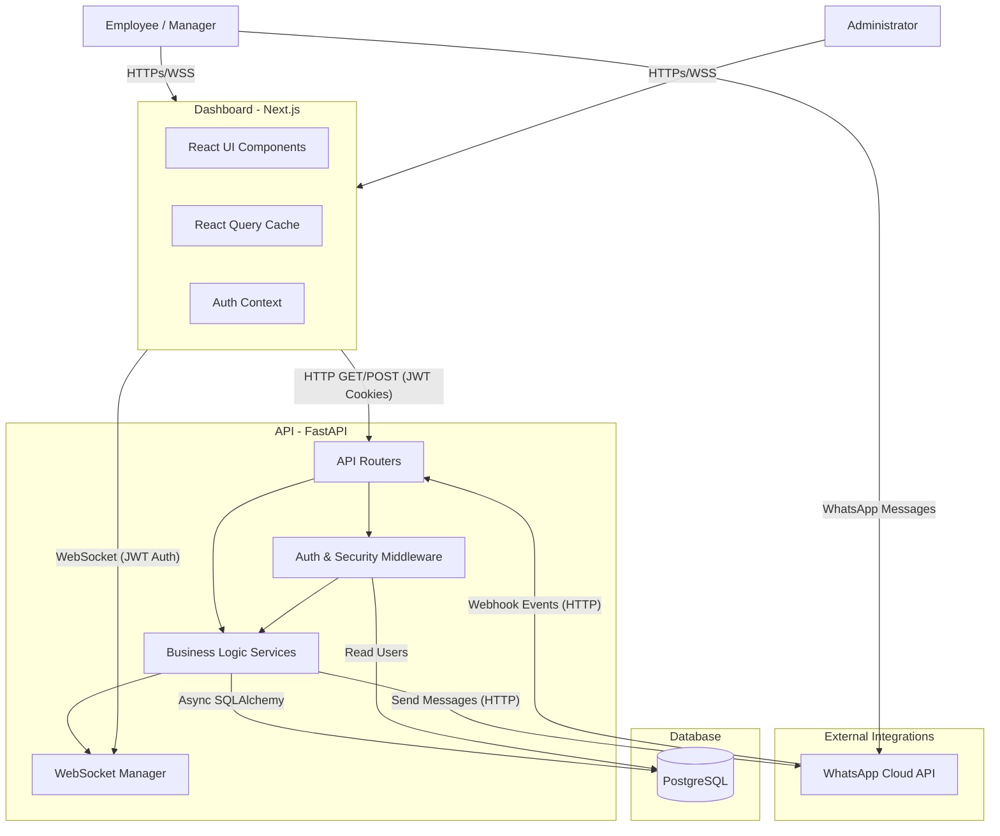

# LeaveFlow Architecture

LeaveFlow is built on a modern, asynchronous stack designed for performance, security, and multi-channel user experience.

## High-Level Architecture

## Tech Stack Details

### Frontend (Dashboard)

- **Framework**: Next.js (App Router)
- **Styling**: Tailwind CSS, shadcn/ui
- **State Management**: React Query (Server state), Context API (Local/Auth state)
- **Authentication**: HTTP-Only Cookies

### Backend (API)

- **Framework**: FastAPI (Python 3.10+)
- **ORM**: SQLAlchemy 2.0 (Async)
- **Database Driver**: asyncpg
- **Security**: PyJWT (v2.13+), Passlib/Bcrypt, slowapi (Rate Limiting)
- **Real-time**: WebSockets (Broadcasting via custom connection manager)

### Database

- **Engine**: PostgreSQL 15+
- **Migrations**: Alembic

### External Integrations

- **WhatsApp Cloud API**: Bidirectional messaging and webhooks for natural language leave requests.
- **OpenRouter (LLM)**: Natural language processing for parsing WhatsApp messages and webhook intents.
